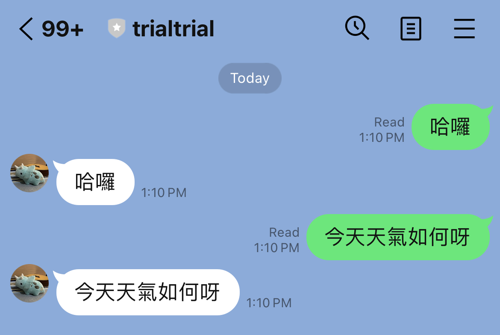

## Utilizing a LINE bot to make a reply same msg bot ##

<figure>

</figure>

<figure>

</figure>

## Tutorial ##

### Step 1. Got A LINE Bot API devloper account ###

Make sure you already registered on [LINE developer console](https://developers.line.biz/en/), if you need use LINE Bot.

- Create new Messaging Channel

- Get Channel Secret on "Basic Setting" tab.

- Issue Channel Access Token on "Messaging API" tab.

- Open LINE OA manager from "Basic Setting" tab.

- Go to Reply setting on OA manager, enable "Use webhook", "Webhook redelivery" and disable "Auto-reply messages"

### Step 2. Deploy on Render ###

Log in/Sing Up to the [Render CLI](https://render.com). Create a Blueprints for specifing your infrastructure as code in a single render.yaml. 

Then, use it to create, update, and connect all your services at once, with automatic syncing of resources.

### Step 3. Verify webhook URL ###

Go to Messaging API tab for the channel you created in the Prepare a Messaging API channel section. Click Verify in Webhook URL to check that webhook is working. 

If there is no problem with the webhook URL, you'll see a message, "Success". You made a working bot.

## Reference ##

[Tutorial - Make a reply bot](https://developers.line.biz/en/docs/messaging-api/nodejs-sample/#send-reply)
